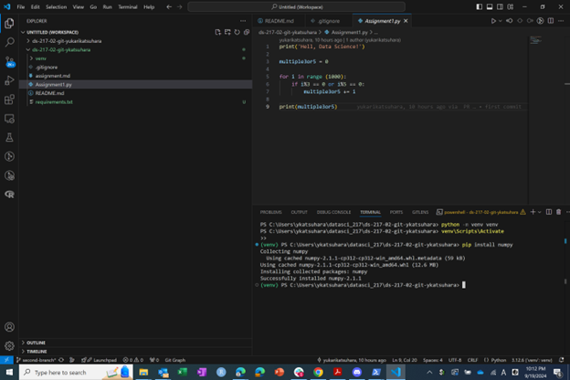

# Assignment 1
## GitHub username: ykatsuhara

## Answer: The sum is 233168.

## Self-Intorduction
### Who am I
I am Yukari Katsuhara, a second year student at Health Data Science Program.

### Why I am here
I have enrolled in this course to improve my GitHub skills, particularly around version control. 

Recently, I have noticed many researchers publishing their code on GitHub, and I would like to gain practical skills in version control to do the same.

### Anything I am specifically hoping to get out of the course
My goal is to be able to manage my code more effectively and eventually publish my own work on GitHub in the near future.

[Link to the official Python website](https://www.python.org)

# Assignment 2
## Screenshot

## My favorite meme
